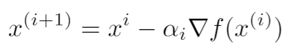
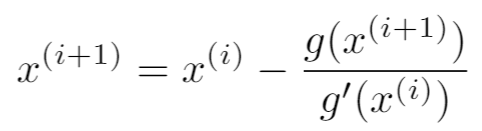

# Comparison of Newton's Method in Optimisation and Gradient Descent
I experiment with and benchmark NM vs. GD for multivariate linear regression, on the Iris flower dataset. Newton's Method converges within 2 steps and performs favourably to GD. However, it requires computation of the Hessian, as well as depends heavily on the weight initialisation.

(Vanilla) Gradient Descent:  

Newton's Method:  

